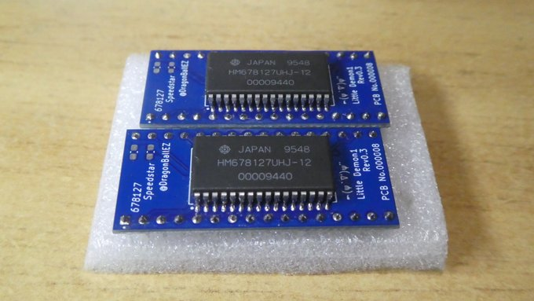
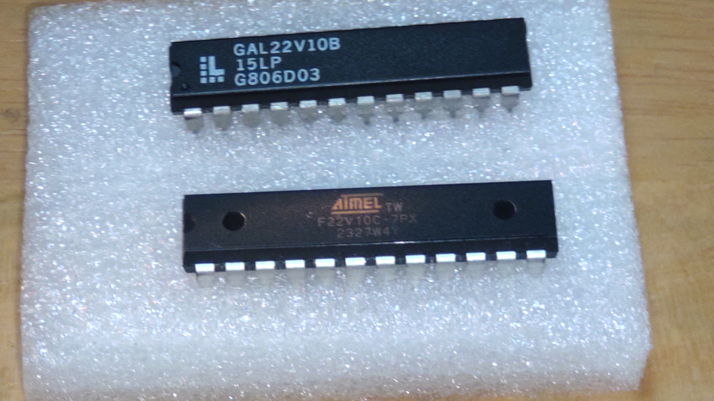
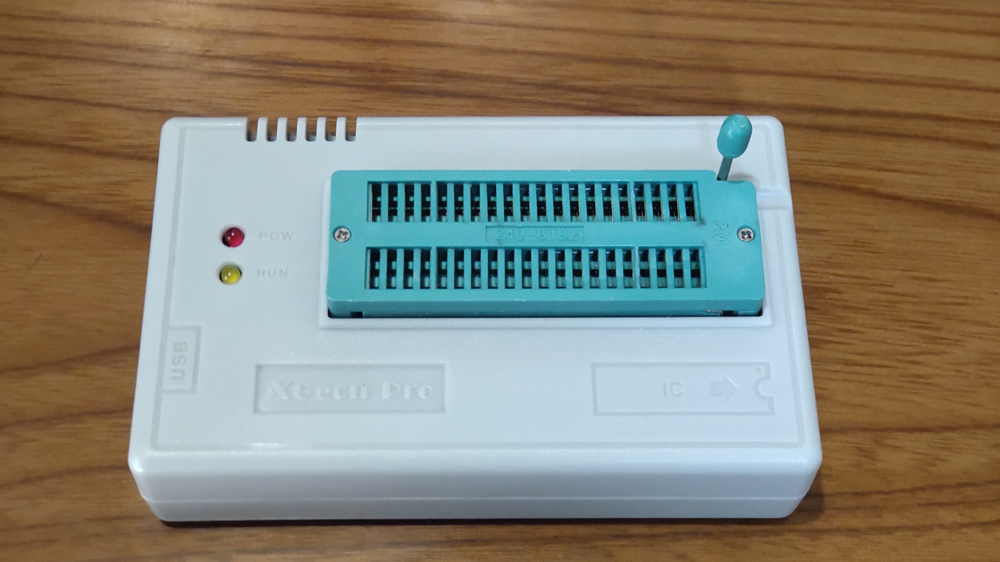

# MEZW65C_RAM-Rev2.1G

工事中( - Under construction - )

 
MEZW65C_RAM-Rev2.1（PCB Rev1.3)からの改良点 
 
１．CPUの高速化 
２．CPLD(GAL)導入によるPCBの部品点数を削減 
３．ファームウェアによる6502、65816の自動判定 

#### １．CPUの高速化(10MHzでの動作）
Rev2.1(PCB Rev1.3)は、6502(8MHz)、65816(6MHz)で動作しています。 
しかし、W65C02S6TPG-14とW65C816S6TPG-14を定格のは14MHzです。 
使用しているSRAM(AS6C4008-55PCN)のアクセスタイムは55nsですから、 
もう少し早く動かすことが出来るはずです。 
色々調べた結果、少し回路を修正すれば出来そうです。 
その為には、標準ロジックICを追加する必要がありますが、 
PCB Rev1.3には面積的にICを追加することは不可能な状況でした。 
 
今回、CPLDを導入し、部品点数を減らしたPCBを作成することで、 
6502、65816を共に10MHzで動作することが出来るようになります。 
  
 
＜余談＞ 
14MHzで動かすには、もっと高速なSRAMが必要です。 
X(旧Twitter)の@DragonBallEZさんが、MH678127UHJ-12の高速SRAMを 
AS6C1008のピン配置に変換するアダプタ「Little Demon1 Rev0.3」を 
を作成しているので、 それを使って実験したところ、14MHzで動作することが 
確認出来ました。 

 
（Little Demon1 Rev0.3）
 

#### ２．CPLD(GAL)導入によるPCBの部品点数を削減
Glue logicは、CPLDを使えば複数の標準ロジックICを、規模にもよりますが 
１つにまとめることが可能です。 
PCB Rev1.3には３つの標準ロジックICがあります。追加のGlue logicと 
３つの標準ロジックICを、１つの22V10タイプのCPLDにまとめることが出来ました。 
CPLDは、私自信にとって初めての挑戦でしたが、うまくいきました。 

 
（今回使用したCPLDとGAL）
 

#### ３．ファームウェアによる6502、65816の自動判定 
Rev2.1(PCB Rev1.3)は、切替スイッチを使って手動でCPUの種類を切り替えていました。 
Rev1.2G(PCB Rev1.6)では、ファームウェアによってCPUを自動判定します。 
その為、切り替えスイッチが無くなっています。 
 
CPLDの導入と、ファームウェアによるCPUの自動判定により、PCBの部品点数が削減されて 
スッキリとなりました。 
CPUの抜き差しをしやすいように、LEDの配置を変更しています。 
部品点数が減ったため、SRAMやPLDの抜き差しも楽になりました。 

# CPLDへのプログラミングと書き込み
CPLDの開発環境は、マイクロチップ社がPLD Design Resourcesとして[WinCUPL](https://www.microchip.com/en-us/products/fpgas-and-plds/spld-cplds/pld-design-resources)を提供しています。 
プログラミング自体は、慣れたテキストエディタを使えます。コンパイルとコード生成（jedファイル） 
をWinCUPLで行います。 
WinCUPLは少し古いソフトですが、Windows11でも動作しています。ただし、インストールすると 
既存の環境変数を書き換えてしまうので、既存の環境変数をバックアップしておく必要があります。 
そうしないと、既存のソフトウェアが立ち上がらなくなったりする不具合が発生するので、 
注意が必要です。 
CPLDのプログラミングについては[ここ](https://satoru8765.hatenablog.com/entry/2024/09/16/174243)が参考になると思います。 
 
 - CPLDへの書き込み 

   CPLDには、ROMライタを使用してMEZW65C_RAM.jedファイルを書込みます。 
   使用したのは、XGecu Programmer Model TL866Ⅱ PLUSです。 
   少し古いですが、問題なく書き込みが出来ました。XGecu Official Siteは[こちら](https://xgecu.myshopify.com/) 

    
（今回使用したROMライタ）

# PIC18F47Q43/Q84/Q83への書き込み
PICへの書き込みツールを用いて、ヘキサファイルを書き込みます。 
 
- PIC18F47Q43 - R2.1GQ43.hex
- PIC18F47Q84 - R2.1GQ84.hex
- PIC18F47Q83 - R2.1GQ83.hex
 
＜注意点＞ 
EMUZ80ボードから、メザニンボード（MEZW65C_RAM Rev2.1G）を外した状態で 
PICへの書き込みを行います。メザニンボードを装着しての書き込みは、失敗が 
多いです。 
もしくは、PICに書き込めるライターを使用します。 
 

- snap(マイクロチップ社の書き込みツール)  

  - [snap](https://www.microchip.com/en-us/development-tool/PG164100)

 
- PICkit3（または互換ツール）  
  PICkitminus書き込みソフトを用いて、書き込むことが出来ます。以下で入手できます。 

  - [PICkitminus](http://kair.us/projects/pickitminus/)
 

# μSDカードの作成
[MEZW65C_RAM Rev2.1のDISKSディレクトリの中身全部](https://github.com/akih-san/MEZW65C_RAM-Rev2.1/tree/main/DISKS)のファイルをμSDカードにコピーします。 
6502/65816を10MHzで動かすため、[コンフィグファイル](DISKS)を上書きします。 

